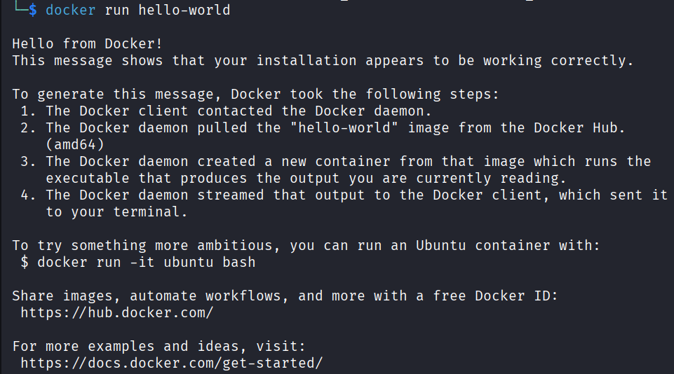

# Docker

## Docker là gì?

**Docker cho phép đóng gói (package) ứng dụng của mình cùng với tất cả những gì cần thiết mã nguồn, thư viện, công cụ hệ thống vào một đơn vị duy nhất, di động được gọi là container**. Container đó có thể chạy ở bất cứ đâu: Máy tính xách tay của ta, máy tính xách tay của đồng nghiệp, máy chủ hoặc đám mây và nó sẽ hoạt động hoàn toàn giống nhau.

Hãy hình dung nó như là một trình giả lập trò chơi điện tử chạy cùng một trò chơi theo cùng một cách bất kể bạn chơi trên máy tính nào.

## Tại sao không cài đặt mọi thứ một cách bình thường?

Hãy ví dụ như một ứng dụng Node.js phiên bản 16, trong khi máy khác lại có phiên bản Node.js là 18, hai phiên bản khác nhau chắc chắn sẽ có những sự khác nhau về tính năng, bảo mật, v.v., điều này có thể phá vỡ một số thứ mà ta không hề mong muốn, đó là lí do vì sao Docker tồn tại.

## Sử dụng docker

### Chạy container đầu tiên của docker

Khi ta hoàn thành tải về chạy docker, việc đầu tiên mà ta có thể thực hiện đó là thực thi câu lệnh sau:

```bash
docker run hello-world
```

Kết quả thu được là container đầu tiên mà ta đã chạy và cài đặt để hiển thị lời chào từ Docker:



### Các lệnh đáng nhớ của docker

Dưới đây là các lệnh cơ bản, sử dụng thông thường và cần phải nhớ trong Docker:

+ `docker ps`: Xem các container đang chạy
+ `docker stop <id>`: Dừng một container đang chạy
+ `docker images`: Liệt kê các ảnh (images) đã tải xuống
+ `docker rmi <image-id>`: Xóa một ảnh
+ `docker image prune`: Xóa các ảnh mà chỉ có tên repository là `<none>:<none>`. Giải pháp này tốt hơn so với `docker rmi` vì nó xóa được các images không cần thiết.
+ `docker exec -it <id> bash`: Mở terminal bên trong một container đang chạy