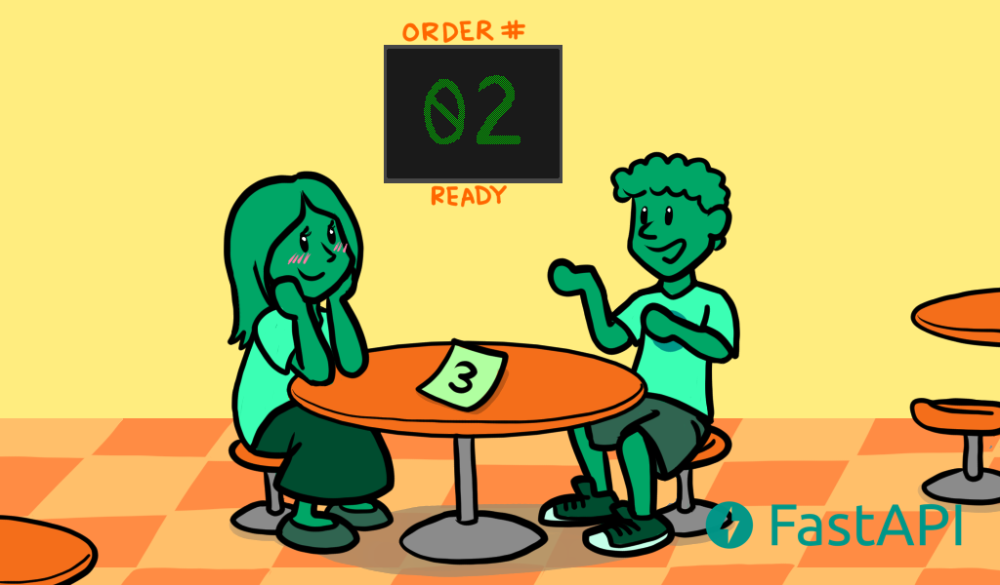
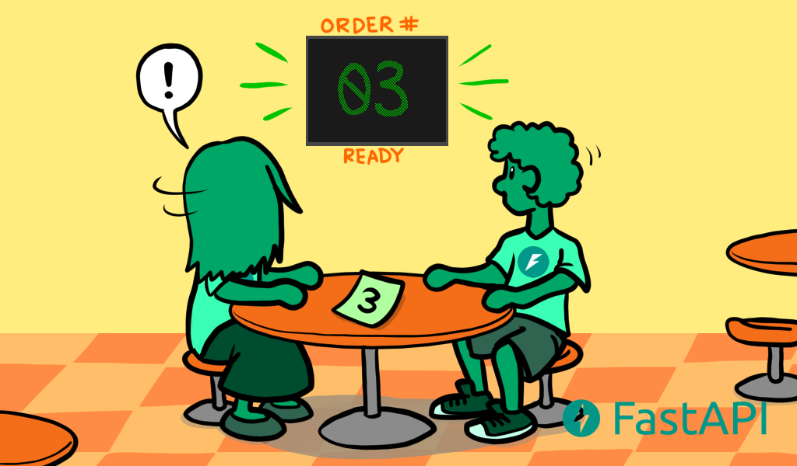
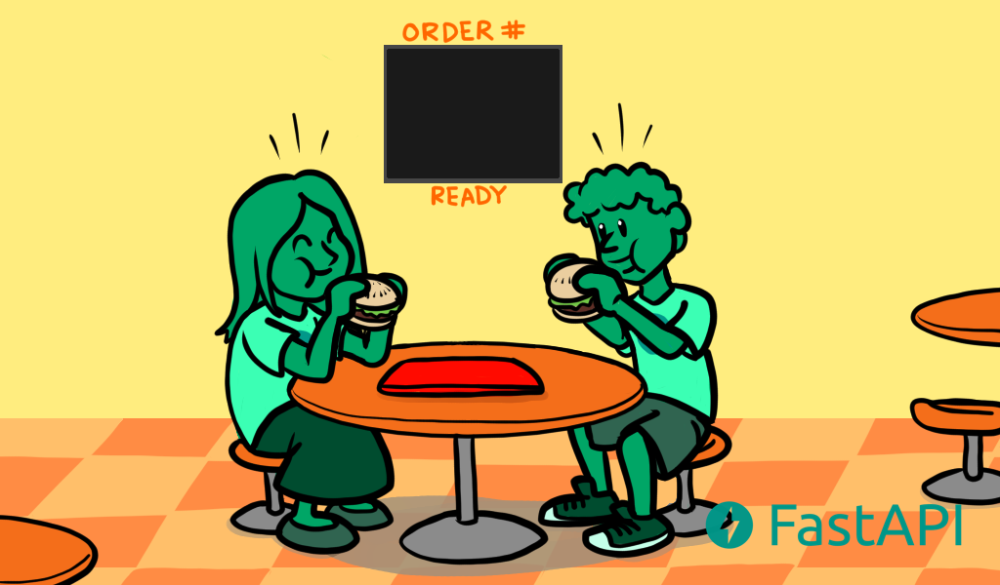
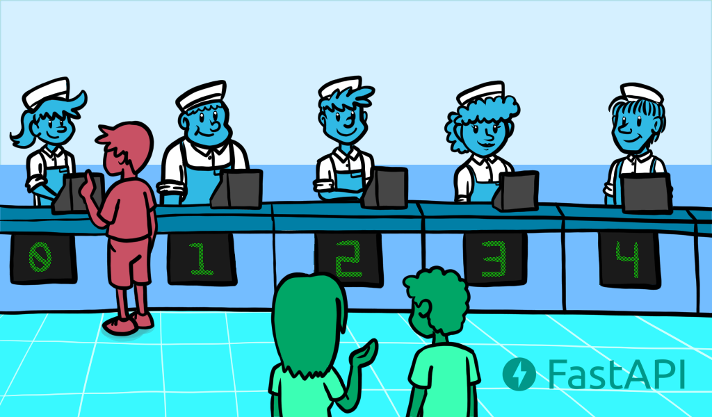
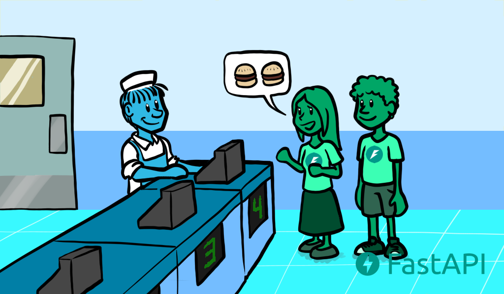
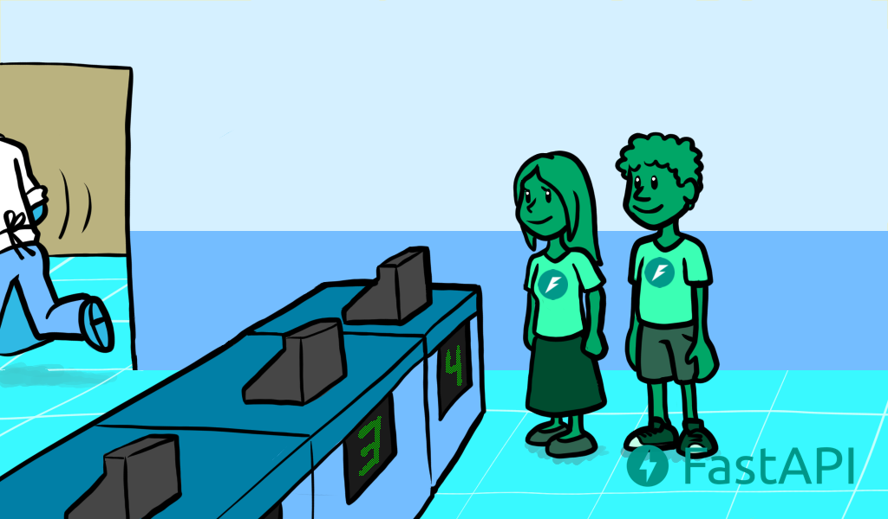
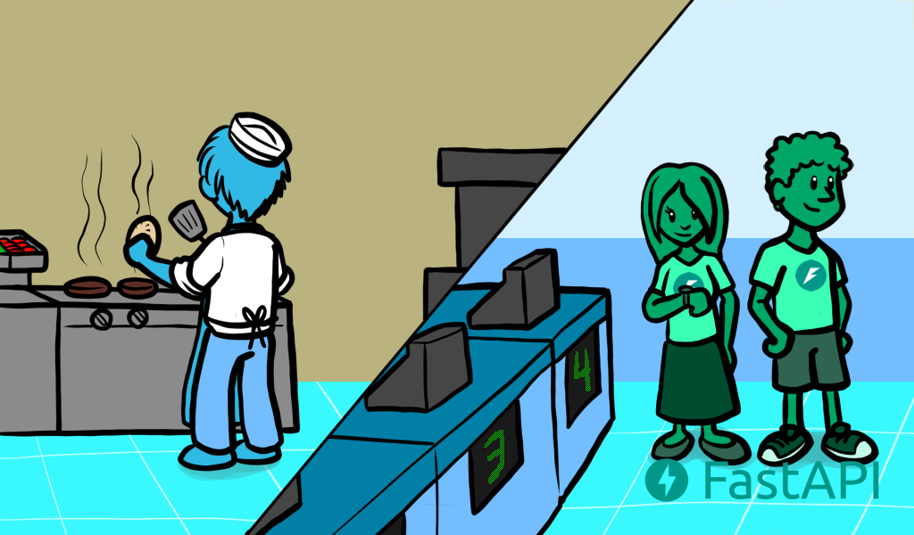
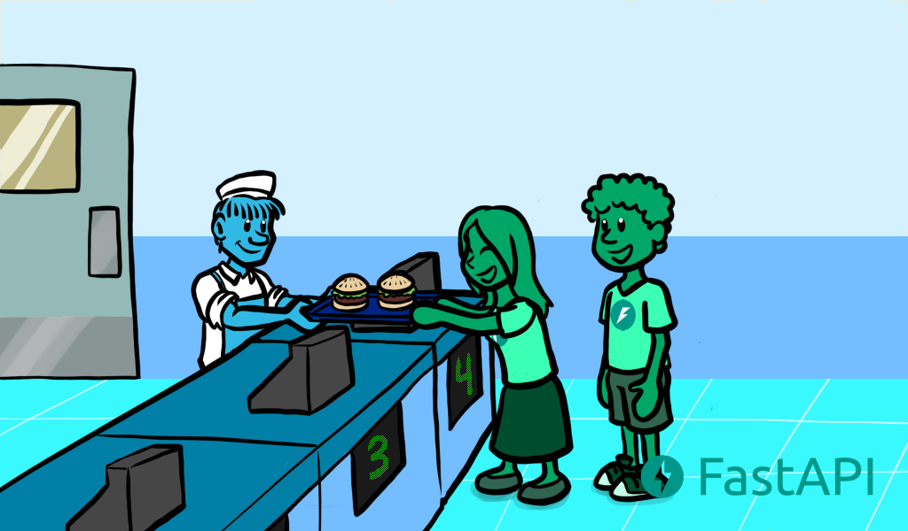

# Xử lý đồng thời và bất đồng bộ (async/await)

Các phiên bản Python hiện đại bây giờ hỗ trợ "mã bất đồng bộ" (asynchronous code) bằng cách sử dụng cái gọi là "coroutine", với cú pháp `async` và `await`.

## Mã bất đồng bộ

Mã bất đồng bộ đơn giản là một ngôn ngữ lập trình nói cho máy tính/chương trình ở một điểm nào đó trong đoạn code, nó phải đợi **một thứ nào đó hoàn thành tại nơi nào đó**. Hãy nói rằng thứ đó gọi là "slow-file". Máy tính lúc đó sẽ đi và hoàn thành công việc khác trong khi "slow-file" đó tự hoàn thành chính nó. Sau đó máy tính sẽ trở lại mỗi khi nó có cơ hội vì nó đang chờ đợi, hoặc khi nào nó hoàn thành tất cả công việc đang làm. Và nó sẽ kiểm tra xem có tác vụ nào nó đang chờ đã hoàn thành chưa, rồi tiếp tục thực hiện những việc cần làm. Tiếp theo, nó sẽ chọn tác vụ đầu tiên cần hoàn thành (ví dụ như "slow-file") và tiếp tục những việc cần làm với tác vụ đó.

Việc chờ một thứ gì đó thường chỉ đến những thao tác nhập/xuất (I/O) tương đối chậm (so với tốc độ của bộ xử lý hoặc bộ nhớ RAM), như là:

+ Dữ liệu từ máy khách cần được gửi qua mạng.
+ Dữ liệu do chương trình của ta gửi để máy khách nhận qua mạng.
+ Nội dung của một tập tin trên ổ đĩa cần được hệ thống đọc và cung cấp cho chương trình của ta.
+ Nội dung chương trình của ta cung cấp cho hệ thống để ghi vào ổ đĩa.
+ Một thao tác API từ xa.
+ Một thao tác CSDL cần hoàn tất.
+ Một truy vấn CSDL cần trả về kết quả.

Thời gian thực thi được sử dụng hầu hết bởi việc chờ đợi thao tác I/O, ta gọi chúng là thao tác "vùng nhập/xuất" (I/O bound).

Việc này được gọi là "bất đồng bộ" **vì máy tính/chương trình không cần phải "đồng bộ" với tác vụ chậm hơn, đợi đúng thời điểm mà chúng hoàn thành mà trong lúc đó không làm gì cả để có thể lấy kết quả từ tác vụ và tiếp tục công việc**.

## Xử lý đồng thời

Ý tưởng của mã bất đồng bộ đôi khi còn được gọi là "xử lý đồng thời" - concurrent (khác với "song song" - parallelism). **Xử lý đồng thời và song song đều liên quan đến "những việc khác nhau xảy ra gần như cùng một lúc"**. Nhưng chi tiết giữa hai ý tưởng này là hoàn toàn khác nhau.

### Ví dụ về tính đồng thời bằng việc đặt burger

Nguồn ví dụ: [FastAPI Official Document - Concurrent Burgers](https://fastapi.tiangolo.com/async/#concurrent-burgers), ở đây chỉ dịch ra tiếng Việt cho tiện thôi.

Bây giờ ta và crush của ta đi đến cửa hàng đồ ăn nhanh, ta và crush đợi trong hàng trong khi thu ngân đang lấy đơn hàng của những người phía trước:


Đến lượt của hai người chúng ta, ta đặt đơn hàng với 2 burger rất xịn sò cho crush và ta:


Lúc này thu ngân nói thẳng với đầu bếp trong nhà bếp thứ mà họ sẽ phải chuẩn bị cho burger của ta, mặc dù họ cũng đang chuẩn bị burger cho vị khách trước:


Ta trả tiền, và thu ngân sẽ cho ta số để biết đến lượt của ta:


Khi mà cả hai đang đợi, chúng ta sẽ chọn một bàn, trò chuyện thân mật, vui vẻ một chút, cứ một lúc là cả hai người sẽ kiểm tra số thứ tự trên quầy để xem đã đến lượt mình chưa:





Đến một lúc nào đó, sẽ đến lượt của hai người, cả hai đến quầy, lấy burger đã đặt và quay trở lại bàn, sau đó cả hai sẽ có thời gian hưởng thụ burger:



Người thực hiện các hình vẽ cho phần này và các phần sau là [Ketrina Thompson](https://www.instagram.com/ketrinadrawsalot).

Ý chính ở đây là ta có thể ví chúng ta như là một máy tính/chương trình trong câu chuyện này, khi mà ta đợi ở hàng đợi cho đến lượt của hai người, chúng ta không làm gì cả. Nhưng đến lượt thì chúng ta sẽ làm các chuyện như là xem menu, quyết định thực đơn dựa trên quyết định của crush của ta, trả tiền, v.v. Nhưng lúc đó ta vẫn chưa có burger vì ta cần phải đợi nó được làm xong, vì thế ta trò chuyện với crush của ta, và đó cũng là làm một cái gì đó. Khi mà thu ngân hoàn thành thực đơn mà ta yêu cầu, ta đến quầy và nhận nó dựa vào số thứ tự, đó là tác vụ "lấy burger" hoàn thành, rồi cuối cùng là tác vụ "ăn burger".

### Ví dụ về tính song song bằng việc đặt burger

Cũng tương tự như tính đồng thời trong việc đặt burger, bây giờ ta và crush của ta đến một cửa hàng đồ ăn nhanh, có 5 người ở cửa hàng đang đặt hàng ở 5 quầy khác nhau, và ta chỉ cần đợi ở một quầy để đặt cho 2 người. Nhưng điều khác biệt là thu ngân ở đây cũng sẽ là đầu bếp, vì thế một khi họ nhận được thực đơn, họ sẽ đi vào bếp để làm thực đơn đó trước khi đi ra lại:



Khi đến lượt của hai người, ta đến và yêu cầu hai burger xịn sò cho crush và ta như cũ, cũng như là ta trả tiền:



Thu ngân sẽ nhận đơn đó và đi vào nhà bếp để chuẩn bị burger, hai người lúc này buộc phải đợi để không có bất kì ai đến "ăn cắp" hay "lấy nhầm" burger của hai người:



Khi ta và crush của ta phải đợi burger đến, đầu bếp/thu ngân đó cũng đang chuẩn bị thực đơn burger mà ta đã đặt cho hai người, đó là "sự đồng bộ" giữa hai tác vụ chờ đợi và chuẩn bị burger:



Và một thời gian sau, đầu bếp/thu ngân sẽ đến giao burger mà cả hai đang chờ đợi:



Ta và crush đem burger đến bàn, ăn nó và hoàn thành bữa ăn:


Ví ta lại như máy tính/chương trình, ta thấy crush và ta cùng nhau đợi và dành sự quan tâm đến việc "đợi ở quầy" trong một khoảng thời gian. Cửa hàng đồ ăn nhanh đó có 5 quầy thu ngân, tức là 5 bộ xử lý, trong khi ví dụ về tính đồng thời ở trên chỉ có 2 (một thu ngân và một đầu bếp). Nhưng trải nghiệm cuối cùng của hai người không có vẻ là tốt hơn so với ví dụ ở tính đồng thời.

### Kết luận về burger

Trong ví dụ về thức ăn burger với crush của ta, có nhiều khoảng phải đợi, và nó xảy ra trong hệ thống đồng thời rất nhiều. Đó cũng là trường hợp cho hầu hết các ứng dụng web. Máy chủ của ta đang chờ đợi từ "các kết nối không tốt đến mấy" từ người dùng để yêu cầu của họ được gửi đến máy chủ, rồi còn phải đợi thêm nữa từ bên họ đến phản hồi có thể tới. Những sự chờ đợi đó chỉ được đo đếm bằng microseconds, nhưng vẫn phải chờ đợi rất nhiều.

Vì lí do trên, các web API sử dụng mã bất đồng bộ, sử bất đồng bộ cũng là lí do vì sao Node.js trở nên nổi tiếng mặc dù nó không song song, hay ngôn ngữ Go có sức mạnh như thế. FastAPI cũng tương tự như thế và ta sẽ có cả hai về tính đồng thời cũng như là song song, khiến ta nhận được hiệu suất cao hơn các framework NodeJS và bằng với ngôn ngữ Go (là ngôn ngữ biên dịch gần với C).

**Chú ý**: Điều này không có nghĩa là tính đồng thời sẽ tốt hơn tính song song, nó chỉ tốt hơn song song khi mà một trường hợp cần rất nhiều lúc phải chờ đợi. Vì thế, nó sẽ tốt hơn nhiều trong tính song song của việc phát triển ứng dụng web, nhưng không phải là tất cả.

### Tính đồng thời và song song là web và học máy

Với FastAPI, ta có thể tận dung tính đồng thời mà rất thường thấy trong việc phát triển web (y như lí do tại sao người ta lại chọn NodeJS). Ta cũng có thể tận dụng tính song song để thực hiện nhiều công việc. Chẳng hạn như ta có một căn nhà có nhiều chỗ, nhiều phòng đang rất dơ. Thì lúc này quay lại câu chuyện của 5 thu ngân tại ví dụ về burger, vì ở dây, ta không phải đợi gì cả, chỉ cần xắn tay vào hoàn thành công việc, nên càng có nhiều người làm (tức là thu ngân làm ở đây), thì ngôi nhà càng sạch nhanh hơn. Và cũng như đã ví mỗi thu ngân là một bộ xử lý, thì **phần lớn thời gian thực thi được dành cho công việc thực tế (thay vì chờ đợi)**, và công việc trong máy tính được thực hiện bởi CPU, nên người ta gọi những vấn đề này là "CPU bound" (vùng CPU).

CPU rất đa dụng, nó có thể học máy (tính toán các vector và ma trận), xử lý âm thanh và hình ảnh, học sâu, v.v. Cộng với việc Python là ngôn ngữ chính cho Khoa học dữ liệu (data science), nên FastAPI theo đó cũng là một lựa chọn phù hợp cho các ứng dụng web, web API cho data science/machine learning.

## `async` và `await`

Các phiên bản hiện đại của Python có cách trực quan để định nghĩa mã bất đồng bộ. Làm cho nó trở thành một mã bình thường, tuần tự và làm "việc chờ đợi" cho chúng ta vào đúng thời điểm. Bây giờ ví dụ như sau:

```python
from fastapi import FastAPI
import asyncio
import uvicorn
app = FastAPI()
async def get_burgers(number: int):
    await asyncio.sleep(2)
    return f"{number} Fresh Burgers coming!"


@app.get('/burgers')
async def read_burgers():
    burgers = await get_burgers(2)
    return {"message": "Order complete!", "food": burgers}


if __name__ == "__main__":
    uvicorn.run("BurgerConcurEx:app", host="127.0.0.1", port=8000, reload=True)
```

Trong đó, một thao tac mà yêu cầu ta phải đợi là biến `burgers`, từ khóa ở `await` ở đây nói cho Python phải đợi `get_burgers(2)` để hoàn thành làm công việc của nó trước khi lưu kết quả vào biến `burgers`. Và như thế. Python sẽ biết nó có thể làm gì và làm việc khác (như là nhận yêu cầu khác).

Để `await` hoạt động, nó **cần phải nằm trong một hàm hỗ trợ việc này một cách bất đồng bộ**, để thực hiện điều đó, ta chỉ cần khai báo bằng `async def` như trên. Với hàm đó, Python sẽ biết rằng bên trong hàm, nó cần phải chú ý tới biểu thức `await` và dừng thực thi hàm đó để làm gì đó khác trước khi quay lại. Điều này dẫn đến biến `burgers` chưa thể hoạt động lúc này.

Vì vậy, nếu ta đang sử dụng một thư viện cho phép gọi nó bằng `await`, thì cần tạo các hàm thao tác đường dẫn (path operation function) sử dụng nó với `async def`, như trong ví dụ trên từ `@app.get('/burgers')` đến `return` với thông điệp JSON.

Để hiểu kĩ hơn đoạn code, xem tại ví dụ `BurgerConcurEx.py` trong thư mục `Labs/FastAPI/AsyncandAwait`.

### Hàm bất đồng bộ lồng nhau

Ta đã biết rằng từ khóa `await` **chỉ có thể được sử dụng trong hàm đã định nghĩa** `async def`. Và cũng như thế, hàm `async def` có khi cũng có thể phải "chờ đợi", nên hàm `async def` có thể được lồng với hàm `async def` khác. Khi sử dụng FastAPI, ta không cần phải quan tâm đến việc gọi hàm `async` đầu tiên nếu có trường hợp lồng nhau, vì hàm đầu tiên đó sẽ là **hàm thao tác đường dẫn**.

### Viết mã bất đồng bộ riêng

Starlette (và FastAPI) được xây dựng dựa trên [AnyIO](https://anyio.readthedocs.io/en/stable/), điều này giúp nó tương thích với cả thư viện chuẩn [asyncio](https://docs.python.org/3/library/asyncio-task.html) của Python và [Trio](https://trio.readthedocs.io/en/stable/). Đặc biệt, có thể trực tiếp sử dụng AnyIO cho các trường hợp sử dụng đa luồng nâng cao, đòi hỏi các mẫu lập trình tiên tiến hơn trong mã của riêng ta.

Và ngay cả khi không sử dụng FastAPI, ta cũng có thể viết các ứng dụng bất đồng bộ của riêng mình bằng AnyIO để có khả năng tương thích cao và tận dụng các lợi ích của nó (ví dụ: đa luồng có cấu trúc).

## Coroutines

Coroutine là thuật ngữ để chỉ **đối tượng được trả về bởi một hàm** `async def`. Python hiểu rằng nó giống như một hàm, có thể bắt đầu và kết thúc tại một điểm, nhưng cũng có thể bị tạm dừng bên trong, bất cứ khi nào có `await` bên trong nó.

Nhưng tất cả chức năng sử dụng mã bất đồng bộ với `async` và `await` **thường được tóm tắt là sử dụng "coroutine"**. Nó tương tự như tính năng chính của Go, "Goroutine".

Ví dụ một đoạn code sau:

```python
import asyncio

# Hàm bất đồng bộ này định nghĩa hàm Coroutine (như một blueprint)
async def cook_burger(id):
    print(f"Bắt đầu nấu burger #{id}")
    await asyncio.sleep(2)
    print(f"Hoàn thành burger #{id}")
    return f"Burger #{id}"


async def main():
    # Gọi hàm bất đồng bộ sẽ không chạy mã, nó chỉ tạo ra đối tượng coroutine
    my_coroutine = cook_burger(42)

    print(f"Kiểu của biến là: {type(my_coroutine)}")
    print(f"Đối tượng thật là: {my_coroutine}\n")

    # để thực thi đoạn mã bên trong nó, ta phải đợi nó
    result = await my_coroutine
    print(f"Kết quả trả về: {result}")

# Khởi động vòng lặp sự kiện để chạy khối hàm main()
asyncio.run(main())
```

Vậy các chi tiết chính ở đây mà ta cần lưu ý:

+ Khi ta gõ `my_coroutine = cook_burger(42)`, không có thứ gì được in ra từ nhà bếp cả, nó không nói "bắt đầu nấu burger" hay gì hết. Thay vào đó, Python gói lệnh gọi hàm vào một gói đặc biệt và chuyển nó cho ta. Khi ta in kiểu của nó, Python sẽ cho ta biết thông qua kết quả in như sau:
  
  ```bash
    Kiểu của biến là: <class 'coroutine'>
    Đối tượng thật là: <coroutine object cook_burger at 0x...>
  ```
  
  Đó là một wrapper đang được ngừng và đợi chỉ thị để chạy tiếp.

+ Đoạn mã bên trong hàm bất đồng bộ `cook_burger` chỉ thức và thực thi khi mà câu lệnh gán `result = await my_coroutine`. Trong đó từ khóa `await` sẽ nói cho đồng hồ bên trong của Python (Event Loop) lấy đối tượng coroutine này, bắt đầu chạy nó, và nếu nó gặp bất kì từ khóa `await` nào nữa bên trong để ngừng thì cho Python biết để nó có thể làm gì đó khác.  

## Hàm thao tác đường dẫn

Hàm thao tác đường dẫn (path operation function) đơn giản là một hàm Python mà ta viết có gắn liền với URL cụ thể của một website (như `/burgers` ở ví dụ burger) và một hành động cụ thể (như phương thức `GET` có từ ví dụ burger trước đó).

Vậy cái này giải thích gì trong việc hàm `async def` được lồng nhau?, Ta có ví dụ để giải thích như sau:

Cho một khách sạn đang phục vụ chúng ta ở đó, ta là một vị khách trong một phòng khách sạn, đại diện cho một hàm Python bình thường (`def`). Bây giờ ta muốn đặt thực đơn một cách "bất đồng bộ" (không đợi ở cửa phòng). Vấn đề sinh ra ở chỗ là ta có một chiếc điện thoại (`async`) trong phòng, nhưng ta cần phải có những chỉ thị đặc biệt (`await`) và ta không thể biết điều đó vì ta chỉ là khách hàng mà thôi. Làm sao để thực hiện được lời gọi đầu tiên?

Giải pháp ở đây đó chính là cơ sở hạ tầng của khách sạn (FastAPI) sẽ thực hiện điều đó thông qua Event Loop:

+ Khi mà một khách hàng (trình duyệt web) gửi yêu cầu đến cho thực đơn (ví dụ là trang `/burgers`), họ sẽ kích hoạt cảm biến (sensor) ngay tại quầy lễ tân.
+ Engine của FastAPI nhận biết điều này, nó sẽ nhìn vào hàm thao tác đường dẫn là `async def read_burgers()` và nó sẽ là hàm gọi `await read_burgers()`.

Hàm thao tác đường dẫn chỉ nên sử dụng hầu hết với hàm `async def` thay vì `def`. Với lí do là khi ta cố chạy `def`, FastAPI sẽ tự lấy hàm `def`, bỏ vào một bể luồng ngoài (external threadpool), cho nó chạy ở đâu, và sử dụng `await` tự cho để thực hiện bất đồng bộ. Điều này là không nên với các thao tác đòi hỏi việc chờ lâu như là thao tác trên CSDL, phải "nhặt" hàm đó lên rồi cố đợi nó sẽ xảy ra overhead, làm chậm FastAPI vì nó phải tạo ra một luồng để chặn ta trong việc chặn cả máy chủ.
