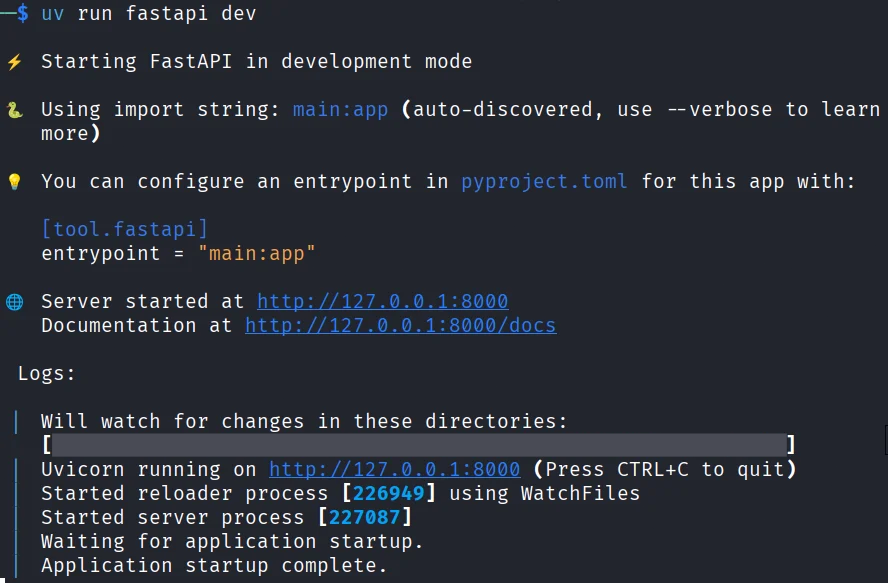
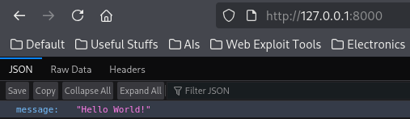
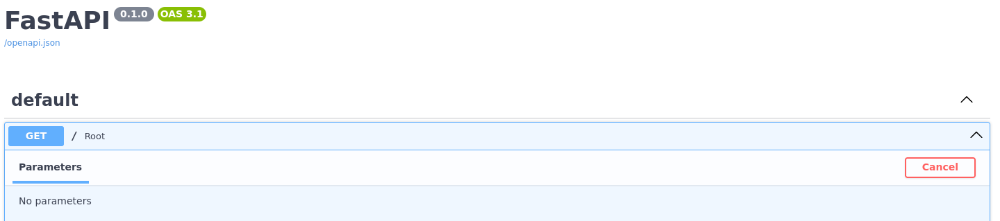
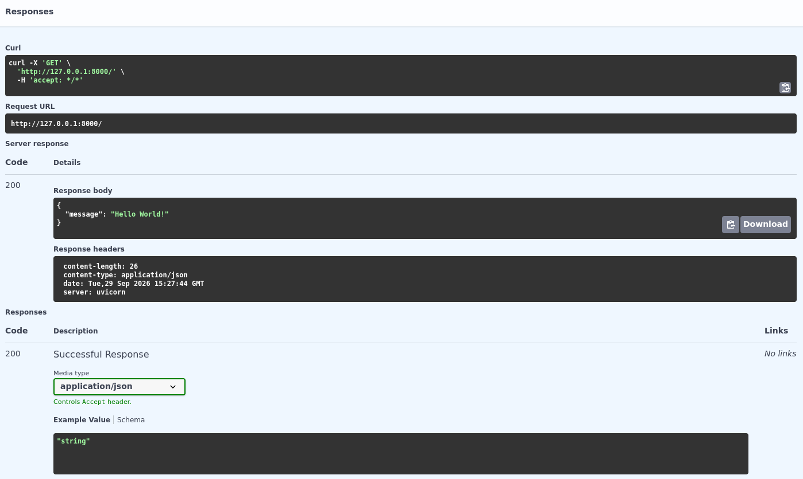
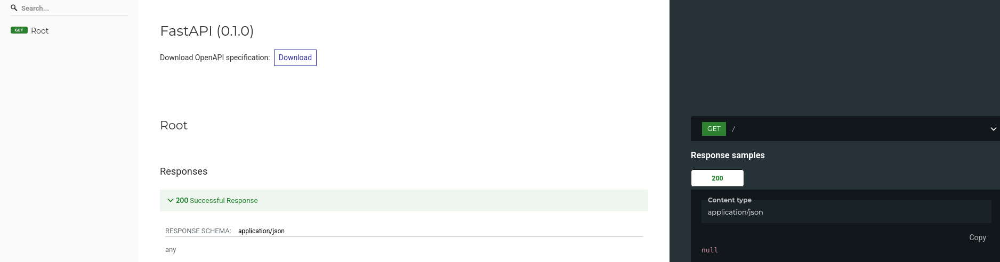
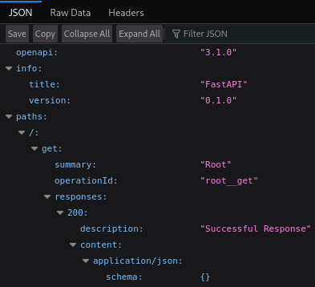
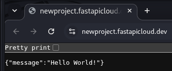
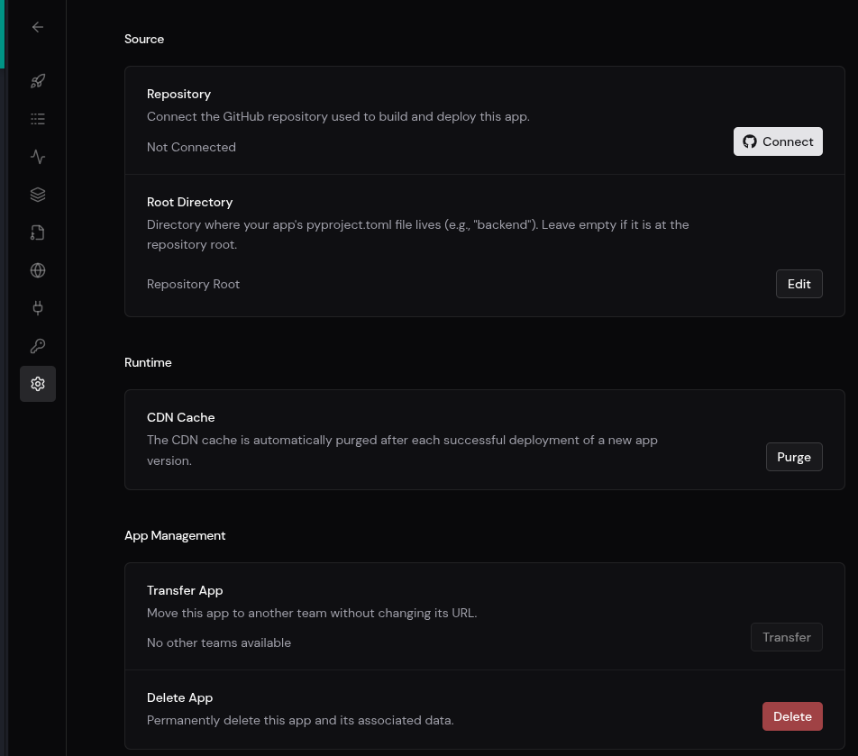

# Bắt đầu với FastAPI

## Cài đặt FastAPI

Để thực hiện cài đặt FastAPI, ta bắt đầu cài đặt `uv` trước. Tham khảo tại [trang cài đặt uv](https://docs.astral.sh/uv/getting-started/installation/).

Sau đó, chạy các lệnh sau:

```bash
uv init newproject --bare
cd newproject
uv add "fastapi[standard]"
```

Lệnh `uv add` **tạo môi trường ảo của dự án trong thư mục `.venv`, thêm FastAPI vào tệp `pyproject.toml` và tạo tệp `uv.lock` để có thể cài đặt cùng phiên bản gói sau này**.

Ngoài ra, các lệnh trên có nghĩa như sau:

+ `uv init` để tạo ra một dự án Python (Python project) mới.
+ `awesome-project` là tên dự án trong nằm trong thư mục cùng tên.
+ `--bare` là tham số để tạo ra tệp `pyproject.toml` tối thiểu mà không cần tạo ra tệp thử `main.py`, `README.md` hoặc các tệp khác.
+ Khi cài đặt bằng lệnh `uv add "fastapi[standard]"`, nó sẽ đi kèm với một số phụ thuộc tiêu chuẩn tùy chọn mặc định, bao gồm fastapi-cloud-cli, cho phép triển khai lên FastAPI Cloud. Nếu không muốn có các phụ thuộc tùy chọn đó, có thể cài đặt bằng lệnh `uv add fastapi`. Còn nếu muốn cài đặt các phụ thuộc tiêu chuẩn nhưng không muốn fastapi-cloud-cli, thì có thể cài đặt bằng lệnh `uv add "fastapi[standard-no-fastapi-cloud-cli]"`.

### AI Agent Skills

**FastAPI bao gồm một kỹ năng (skill) chính thức dành cho các agent lập trình AI**. Kỹ năng này được tích hợp sẵn trong gói phần mềm, do đó hướng dẫn của nó sẽ luôn phù hợp với phiên bản FastAPI được cài đặt trong dự án của ta và sẽ được cập nhật khi ta cập nhật FastAPI.

Sau khi cài đặt FastAPI trong dự án của ta, ta có thể cài đặt kỹ năng này bằng cách sử dụng Library Skills (tham khảo Library Skills [tại đây](https://library-skills.io/#why-library-skills)):

```bash
uvx library-skills
```

**Lưu ý**: `uvx` là tên gọi khác của lệnh `uv tool run`. Lệnh này chạy Library Skills trong một môi trường tạm thời, biệt lập trong khi Library Skills quét các gói đã được cài đặt trong dự án của ta.

Kỹ năng này tương thích với Codex, Claude Code, Cursor, GitHub Copilot, Gemini CLI, Pi, OpenCode và hầu hết các trình soạn thảo mã khác. Đối với Claude Code, hãy chọn `.claude/skills` khi được hỏi nơi cài đặt kỹ năng.

## Thực thi FastAPI cơ bản

Đây là một cấu trúc tệp fastAPI đơn giản như sau:

```python
from fastapi import FastAPI

app = FastAPI()


@app.get("/")
async def root():
    return {"message": "Hello World!"}
```

Trong đó:
+ `FastAPI` là lớp Python cung cấp mọi tính năng của FastAPI (nó là lớp thừa kế trực tiếp từ `Starlette`).
+ `app = FastAPI()` sẽ tạo một thể hiện `app` của lớp `FastAPI`.
+ `@app.get("/")` là một thao tác đường dẫn (path operation) mà ta đã đề cập trước đó. Cụ thể, nó nói với FastAPI rằng hàm dưới đây sẽ thực hiện xử lý các yêu cầu đến đường dẫn `/` và sử dụng phương thức GET HTTP. Vì thế, một URL như sau:

    ```text
    [https://example.com/items/foo](https://example.com/items/foo)
    ```
    
    Đường dẫn sẽ là:

    ```text
    /items/foo
    ```
    
    **Lưu ý**: Một đường dẫn (path) còn được gọi là endpoint (điểm cuối) hay route (đường dẫn).
    
    + Cú pháp `@something` trong Python được gọi là decorator. Ta đặt nó lên trên một hàm. Giống như một chiếc mũ trang trí đẹp mắt. Một decorator nhận hàm bên dưới và thực hiện một thao tác nào đó với nó. Trong trường hợp của chúng ta, decorator này cho FastAPI biết rằng hàm bên dưới tương ứng với đường dẫn `/` với thao tác `get`.
    + Các phương thức HTTP sẽ bao gồm POST (tạo dữ liệu), GET (lấy dữ liệu), PUT (cập nhật dữ liệu), DELETE (xóa dữ liệu), OPTIONS, HEAD, PATCH và TRACE. **Mỗi phương thức HTTP trong FastAPI sẽ dược xem là thao tác (operation)**. Vì thế, decorator ở trên còn có thể có các thao tác khác như:

        + `@app.post()`
        + `@app.put()`
        + `@app.delete()`
        + `@app.options()`
        + `@app.head()`
        + `@app.patch()`
        + `@app.trace()`
+ Hàm `async def root()` mẫu là một hàm bất đồng bộ bình thường của FastAPI, ta có thể sử dụng `def root()` đồng bộ bình thường.
+ Dòng cuối là sử dụng cấu trúc dữ liệu JSON. Ta có thể trả về một tự điển (dict), danh sách (list), các giá trị đơn lẻ như chuỗi, số nguyên, v.v. Ta cũng có thể trả về các mô hình Pydantic. **Có rất nhiều đối tượng và mô hình khác sẽ được tự động chuyển đổi sang JSON (bao gồm cả ORM, v.v.)**. Hãy thử sử dụng những đối tượng và mô hình mà ta mong muốn, rất có thể chúng đã được hỗ trợ.

Đặt tên tệp là `main.py` (cần thiết), rồi thực hiện như hình dưới đây:



Vào địa chỉ `http://127.0.0.1:8000/` sẽ có kết quả là thông điệp `Hello World` dưới dạng JSON:



Vào địa trang `http://127.0.0.1:8000/docs`, trang web sẽ có tài liệu API tương tác tự động (được cung cấp bởi Swagger UI):



Ta cũng có thể tương tác để có dữ liệu `Hello World!` đã thực hiện:



Ngoài ra, còn có một trang khác không được nhắc đến nhưng có sẵn là tài liệu API tương tác tự động thay thế như SwaggerUI tại đường dẫn `http://127.0.0.1:8000/redoc` (được cung cấp bởi ReDoc):



## OpenAPI trong FastAPI

**Lược đồ OpenAPI là nền tảng cho hai hệ thống tài liệu tương tác được tích hợp sẵn**. Và có hàng tá lựa chọn thay thế khác, tất cả đều dựa trên OpenAPI. Ta có thể dễ dàng thêm bất kỳ lựa chọn thay thế nào trong số đó vào ứng dụng của mình được xây dựng bằng FastAPI. Ta cũng có thể sử dụng nó để tự động tạo mã cho các ứng dụng khách giao tiếp với API của ta. Ví dụ như ứng dụng giao diện người dùng, ứng dụng di động hoặc ứng dụng IoT.

**FastAPI tạo ra một lược đồ (schema) với tất cả API của ta bằng cách sử dụng tiêu chuẩn OpenAPI để định nghĩa API**. Một **lược đồ là một định nghĩa hoặc mô tả về một cái gì đó. Không phải là mã thực hiện nó, mà chỉ là một mô tả trừu tượng**. Trong trường hợp này, OpenAPI là **một đặc tả quy định cách định nghĩa lược đồ của API của ta**. Định nghĩa lược đồ này **bao gồm các đường dẫn API, các tham số có thể có mà chúng nhận, v.v**.

### Lược đồ dữ liệu

Thuật ngữ lược đồ **cũng có thể đề cập đến cấu trúc của một số dữ liệu**, chẳng hạn như nội dung JSON. Trong trường hợp đó, nó có nghĩa là các thuộc tính JSON và các kiểu dữ liệu mà chúng có, v.v.

### OpenAPI và Lược đồ JSON

OpenAPI định nghĩa một lược đồ API cho API của ta. Và lược đồ đó bao gồm các định nghĩa (hoặc lược đồ) của dữ liệu được gửi và nhận bởi API của ta bằng cách sử dụng Lược đồ JSON (JSON Schema - tham khảo thêm [tại đây](https://json-schema.org/learn/getting-started-step-by-step)), là tiêu chuẩn cho lược đồ dữ liệu JSON.

Nếu ta muốn hiểu thêm về cấu trúc lược đồ OpenAPI thô, FastAPI tự động tạo ra một tệp JSON (lược đồ) mô tả tất cả các API của ta, có thể xem trực tiếp tại: `http://127.0.0.1:8000/openapi.json`. Nó sẽ hiển thị một tệp JSON bắt đầu bằng nội dung tương tự như hình sau:



## Cấu hình điểm vào (`entrypoint`) trong tệp `pyproject.toml`

Ta có thể cấu hình địa điểm mà ứng dụng của ta được định vị ở chỗ nào trong tệp `pyproject.toml` như sau:

```toml
[tool.fastapi]
entrypoint = "main:app"
```

Biến `entrypoint` sẽ nói cho lệnh `fastapi` rằng nó nên import một ứng dụng như sau:

```python
from main import app
```

Nếu ta có cấu trúc ví dụ như:

```bash
.
├── backend
│   ├── main.py
│   ├── __init__.py
```

Thì ta sẽ gán biến `entrypoint` như sau:

```python
[tool.fastapi]
entrypoint = "backend.main:app"
```

Nó sẽ là đồng nghĩa với:

```python
from backend.main import app
```

Ta cũng có thể truyền đường dẫn tệp cho lệnh `fastapi dev`, và nó sẽ tự động đoán đối tượng ứng dụng FastAPI cần sử dụng:

```bash
uv run fastapi dev main.py
```

Hoặc ta có thể sử dụng tham số `--entrypoint` cho lựa chọn `fastapi dev`:

```bash
uv run fastapi dev --entrypoint main:app
```

**Nhưng ta sẽ phải nhớ truyền đúng đường dẫn/điểm vào mỗi khi gọi lệnh `fastapi`**.

**Ngoài ra, các công cụ khác có thể không tìm thấy nó**, ví dụ như VS Code Extension hoặc FastAPI Cloud, vì vậy ta nên sử dụng `entrypoint` trong `pyproject.toml`.

## Triển khai ứng dụng FastAPI

Ta có thể tùy chọn triển khai (deploy) ứng dụng FastAPI của mình lên FastAPI Cloud bằng lệnh sau:

```bash
uv run fastapi deploy
```

Kêt quả thu được sẽ tương tự như hình dưới đây (chỉ thu được sau khi qua một số thủ tục của FastAPI):



Giao diện dòng lệnh (CLI) sẽ tự động phát hiện ứng dụng FastAPI của ta và triển khai nó lên đám mây. Nếu ta chưa đăng nhập, trình duyệt của ta sẽ mở ra để hoàn tất quá trình xác thực.

Để thực hiện xóa và ngắt liên kết app mà ta đã dựng trên cloud, vào tại app trên trang web cloud với tài khoản đã liên kết và xác thực, sau đó vào mục **Settings**, rồi kéo xuống cho đến khi tìm được mục **Delete App** thì nhấn vào nút **Delete**



Sau đó dùng thêm lệnh sau để tránh CLI cố gắng kết nối lại vì nó còn nhớ liên kết đã tạo trước đó:

```bash
uv run fastapi cloud unlink
```

