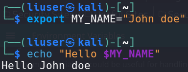
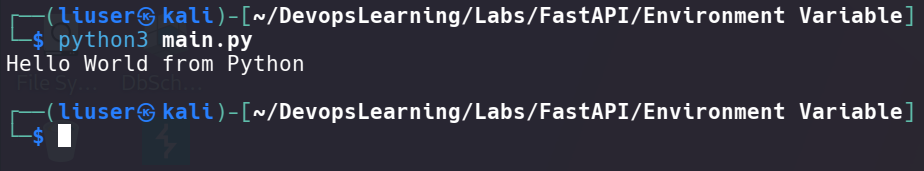
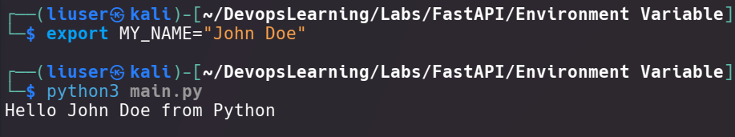
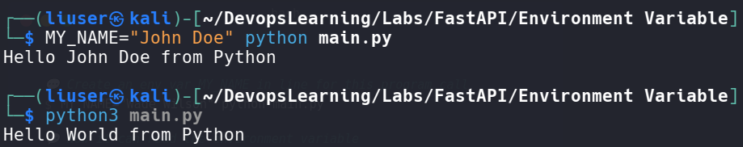

# Biến môi trường

## Khái niệm

Một biến môi trường, còn được gọi là "env var" là một **biến nằm ngoài mã Python**, trong hệ điều hành và có thể được đọc bởi mã Python của ta (hoặc bởi các chương trình khác).

Biến môi trường có thể hữu ích để **xử lý các thiết lập ứng dụng**, như một phần của quá trình cài đặt Python, v.v.

Trong Linux, ta có thể tạo các biến môi trường trong terminal bằng một ví dụ về biến môi trường `MY_NAME` như sau:



Chú ý: Sau khi thực hiện xong việc gán giá trị cho biến, ta có thể sử dụng lệnh sau để bỏ giá trị của biến môi trường, cho nó quay lại như ban đầu:

```bash
$unset MY_NAME
```

## Được biến môi trường trong Python

Ta **cũng có thể tạo các biến môi trường bên ngoài Python**, trong terminal (hoặc bằng bất kỳ phương pháp nào khác), rồi đọc chúng trong Python. Ví dụ về một tệp `main.py` với nội dung như sau:

```python
import os

name = os.getenv("MY_NAME", "World")
print(f"Hello {name} from Python")
```

Thấy rằng ở ví dụ này, ta sẽ in ra chuỗi `Hello... from Python` với biến `name`, hàm `getenv()` từ module `os` sẽ lấy giá trị biến môi trường `MY_NAME` (nếu không có gì trong hàm thì mặc định là `NONE`), thực hiện trên terminal của Linux, ta được:



Nhưng nếu ta quay lại ví dụ ban đầu, khởi tạo một biến với chuỗi cho trước, rồi sử dụng lại chương trình `main.py` trên, ta có kết quả:



Python sẽ đọc được biến môi trường đó và in ra chuỗi đã được gán vào.

Vì các biến môi trường **có thể được thiết lập bên ngoài mã nguồn nhưng vẫn có thể được mã nguồn đọc và không cần phải được lưu trữ** (committed to git) **cùng với các tệp khác**, nên chúng thường được sử dụng để cấu hình hoặc thiết lập.

**Có thể tạo một biến môi trường chỉ dành cho một lần gọi chương trình cụ thể**, chỉ khả dụng cho chương trình đó và chỉ trong suốt thời gian chạy của nó. Để làm điều đó, hãy tạo nó ngay trước chính chương trình, trên cùng một dòng như ví dụ sau:



Thấy rằng khi khởi tạo biến cùng với việc thông dịch chương trình Python, nó sẽ in ra kết quả cùng một lúc. Nhưng chỉ có thể nằm trong chính chương trình đó, gọi lại lần thứ hai thì biến môi trường đó sẽ không mang chuỗi `John Doe` như mong đợi nữa.

## Các kiểu dữ liệu và kiểm tra tính hợp lệ

**Các biến môi trường này chỉ có thể xử lý chuỗi văn bản vì chúng nằm ngoài Python và phải tương thích với các chương trình khác và phần còn lại của hệ thống** (và thậm chí với các hệ điều hành khác nhau, như Linux, Windows, macOS).

**Điều đó có nghĩa là bất kỳ giá trị nào được đọc trong Python từ một biến môi trường sẽ là một chuỗi (str)**, và **bất kỳ chuyển đổi sang kiểu dữ liệu khác hoặc bất kỳ kiểm tra tính hợp lệ nào đều phải được thực hiện trong mã**.

## Biến môi trường `PATH`

Có một biến môi trường đặc biệt gọi là `PATH` được các hệ điều hành (Linux, macOS, Windows) **sử dụng để tìm các chương trình cần chạy**.

**Giá trị của biến** `PATH` **là một chuỗi dài gồm các thư mục được phân tách bởi dấu hai chấm** (:) trên Linux và macOS, và bởi dấu chấm phẩy (;) trên Windows.

Ví dụ, biến môi trường PATH có thể trông như thế này:

```bash
/usr/local/bin:/usr/bin:/bin:/usr/sbin:/sbin
```

Điều này có nghĩa là hệ thống sẽ tìm các chương trình nằm trong các thư mục

+ `/usr/local/bin`
+ `/usr/bin`
+ `/bin`
+ `/usr/sbin`
+ `sbin`

Khi ta gõ một lệnh trong cửa sổ dòng lệnh, hệ điều hành sẽ tìm kiếm chương trình đó trong mỗi thư mục được liệt kê trong biến môi trường `PATH`. Ví dụ, khi ta gõ `python3` trong cửa sổ dòng lệnh, hệ điều hành sẽ tìm kiếm chương trình có tên là `python` trong thư mục đầu tiên trong danh sách đó. Nếu tìm thấy, nó sẽ sử dụng chương trình đó. Nếu không, nó sẽ tiếp tục tìm kiếm trong các thư mục khác.

### Cài đặt Python và cập nhật biến `PATH`

Trong Linux, Python ngay từ đầu đã được cài sẵn, và hiện nay nó sẽ là Python phiên bản 3.x.
Nhưng nếu trong trường hợp mà ta cần phải cài đặt Python vì lí do nào đó, thì ta cũng nên hiểu cách để cập nhật biến `PATH`.

Cho rằng khi ta cài Python và nó được đặt trong thư mục `/opt/custompython/bin`.
Nếu ta chấp nhận cập nhật biến môi trường `PATH`, trình cài đặt sẽ tự động thêm `/opt/custompython/bin` vào biến môi trường `PATH`.
Nó có thể là như sau:

```bash
/usr/local/bin:/usr/bin:/bin:/usr/sbin:/sbin:/opt/custompython/bin
```

Với cách này, khi ta nhập `python` trong terminal, hệ thống sẽ tìm chương trình Python trong thư mục `/opt/custompython/bin` và sử dụng cái đó. Vì thế, nếu ta gõ

```bash
python
```

Nó sẽ tương tự như:

```bash
/opt/custompython/bin/python
```
