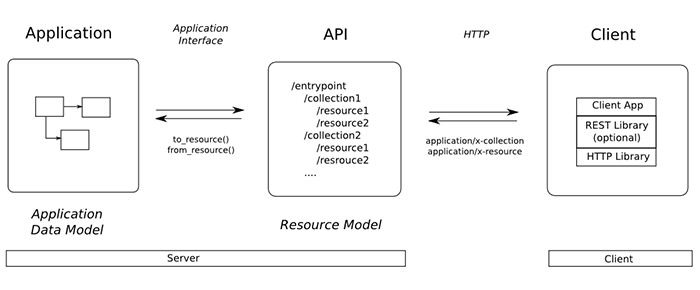

# REST API

RESTful API là một tiêu chuẩn dùng trong việc thiết kế API cho các ứng dụng web (thiết kế dịch vụ web) để tiện cho việc quản lý các tài nguyên. Chú trọng vào tài nguyên hệ thống (tệp, văn bản, hình ảnh, âm thanh,...). Bao gồm các trạng thái tài nguyên được định dạng và được truyền tải qua HTTP.

## RESTful API hoạt động như thế nào?



REST hoạt động chủ yếu dựa vào giao thức HTTP. Các hoạt động cơ bản nêu trên sẽ sử dụng những phương thức HTTP riêng.

+ GET (SELECT): Trả về một tài nguyên hoặc một danh sách tài nguyên.
+ POST (CREATE): Tạo mới một tài nguyên.
+ PUT (UPDATE): Cập nhật thông tin cho tài nguyên.
+ DELETE (DELETE): Xoá một tài nguyên.
+ PATCH: Cập nhật một phần của tài nguyên.

## Endpoint

Endpoint (điểm cuối) là một URL kết hợp với phương thức HTTP. Một REST API sẽ sử dụng các danh từ thay vì các động từ trong URL, ví dụ:

+ `GET    /api/products`: Xem tất cả hàng hóa trong một web bán hàng.
+ `GET    /api/products/42`: Xem hàng hóa có ID 42 trong một web bán hàng.
+ `POST   /api/products`: Gửi dữ liệu trong thân yêu cầu để tạo ra một sản phẩm mới.
+ `DELETE /api/products/42`: Xóa mặt hàng có ID 42 đi.

## Xác thực (authentication) và dữ liệu trả về

RESTful API không sử dụng session và cookie, nó sử dụng một `access_token` với mỗi yêu cầu. Dữ liệu trả về thường có cấu trúc như sau:

```json
{
    "data" : {
        "id": "1",
        "name": "It's me!"
    }
}
```

## Mã trạng thái

Khi chúng ta request một API nào đó thường thì sẽ có vài mã trạng thái (status code) để nhận biết sau:

+ 200 OK: Trả về thành công cho những phương thức GET, PUT, PATCH hoặc DELETE.
+ 201 Created: Trả về khi một tài nguyên vừa được tạo thành công.
+ 204 No Content: Trả về khi tài nguyên xoá thành công.
+ 304 Not Modified: Client (máy khách) có thể sử dụng dữ liệu cache.
+ 400 Bad Request: Yêu cầu không hợp lệ
+ 401 Unauthorized: Yêu cầu cần có auth.
+ 403 Forbidden: Bị từ chối không cho phép vì không có đủ quyền.
+ 404 Not Found: Không tìm thấy tài nguyên từ URI
+ 405 Method Not Allowed: Phương thức không cho phép với người dùng hiện tại.
+ 410 Gone: Tài nguyên không còn tồn tại, phiên bản cũ đã không còn hỗ trợ.
+ 415 Unsupported Media Type: Không hỗ trợ kiểu tài nguyên này.
+ 422 Unprocessable Entity: Dữ liệu không được xác thực
+ 429 Too Many Requests: Yêu cầu bị từ chối do bị giới hạn

## Các yêu cầu HTTP

HTTP request có tất cả 9 phương thức, 2 phương thức được sử dụng phổ biến nhất là GET và POST

+ GET: Được sử dụng để lấy thông tin từ server theo URI đã cung cấp.
+ HEAD: Giống với GET nhưng phản hồi trả về không có body, chỉ có header.
+ POST: Gửi thông tin tới sever thông qua các biểu mẫu HTTP (thường là khi gửi biểu mẫu HTML).
+ PUT: Ghi đè tất cả thông tin của đối tượng với những gì được gửi lên.
+ PATCH: Ghi đè các thông tin được thay đổi của đối tượng.
+ DELETE: Xóa tài nguyên trên server.
+ CONNECT: Thiết lập một kết nối tới server theo URI.
+ OPTIONS: Mô tả các tùy chọn giao tiếp cho tài nguyên.
+ TRACE: Thực hiện một bài test loopback theo đường dẫn đến tài nguyên.

## Phân quyền (Authorization)

Có 3 cơ chế chính cho RESTFul API:

+ HTTP Basic
+ JSON Web Token (JWT)
+ OAuth2

Tùy thuộc vào dịch vụ, chọn loại phân quyền có mức độ phù hợp và cố gắng giữ nó càng đơn giản càng tốt.

## Tài liệu API

Việc viết tài liệu API là cần thiết, tuy nhiên để có một tài liệu API hoàn chỉnh, nên nếu thời gian gấp rút thì người ta chỉ viết tài liệu API đơn giản.

Nếu không được chăm sóc kỹ, thì đến lúc duy trì hoặc thay đổi cấu hình thì hậu quả sẽ rất thảm khốc, dưới đây là một số lưu ý lúc viết các tài liệu:

+ Mô tả đầy đủ về tham số yêu cầu nào: gồm những tham số nào nào, kiểu  dữ liệu, require hay optional.
+ Nên đưa ra các ví dụ về HTTP yêu cầu requests và phản hồi với dữ liệu chuẩn.
+ Cập nhật tài liệu thường xuyên, để sát nhất với API có bất cứ thay đổi gì.
+ Định dạng, cú pháp cần phải nhất quán, mô tả rõ ràng, chính xác.
